# Git in Production

_Rough_ agenda:

1. Requirements
2. Basics of git
3. Branches
4. Merging
5. Rewriting History
6. Remote(s)
7. Code review
8. Collaboration

---

# Requirements

- Have [git](https://git-scm.com/) installed
- Have a [github.com](https://github.com/) account connected to your machine (preferrably [via SSH](https://docs.github.com/en/authentication/connecting-to-github-with-ssh/generating-a-new-ssh-key-and-adding-it-to-the-ssh-agent?platform=mac))
- Some basic knowledge of the [CLI](https://en.wikipedia.org/wiki/Command-line_interface) on your machine (how to move around, create/delete files, etc.)
- That's it

---

# What is git?

= free and open source distributed version control system (VCS)

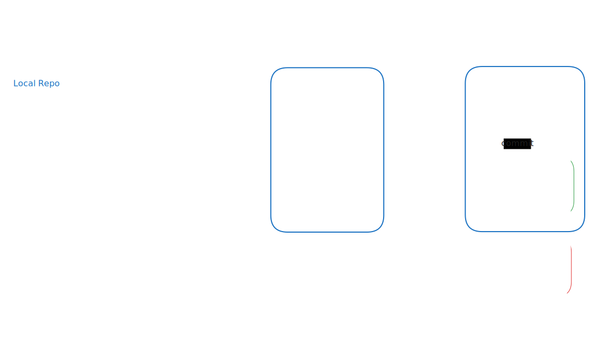

<!--
Instead of the traditional centralized control system where even checking out a file required admin priviledges, git allows any work to be locally and may diverge as much as you want.
-->

---

# Your first git repo

1. Create a local repo with

   ```sh
   git init
   ```

<!--
Let's check out what happened: "ls" -> Huh? -> "ls -a" -> Aha!
-->

2. Configurate

   If the following cmd has no output:

   ```sh
   git config --get user.name
   ```

   You need to configure your username and email

   ```sh
   git config --add --local user.name "Louis Kapp"
   git config --add --local user.email "l.kapp@4eign.de"
   ```

   You can check your whole configuration using

   ```sh
   git config --list
   ```

<!--
Every commit comes with the author's name and email. So to ensure you get proper credit and/or blame for all the wonderful code you add, we need to set our name and email!
-->

---

# The Basics

These simple commands suffice 80% of the time

- `git add <path-to-file | pattern>` will add zero or more files to the index (staging area)
- `git commit -m '<message>'` will commit what changes are present in the index.
- `git status` will describe the state of your git repo which will include tracked, staged, and untracked changes.

---

# The vi experience

You're cooked

<div style="display: flex; gap: 50px">

<div>

You may wonder what happens if you just `git commit` without specifying a `--message` (`-m`):

```vim

# Please enter the commit message for your changes. Lines starting
# with '#' will be ignored, and an empty message aborts the commit.
#
# On branch main
#
# Initial commit
#
# Changes to be committed:
#       new file:   test.md
#
```

Quit [vi](<https://en.wikipedia.org/wiki/Vi_(text_editor)>) using `:q!` or specify your favorite editor (e.g. VSCode) in your git config to never end up in this situation: `git config --global core.editor "code"`

</div>

<div>
  
  <small><a href="https://www.reddit.com/r/ProgrammerHumor/comments/vatjrp/how_to_exit_vim/">r/ProgrammerHumor</a></small>
</div>

</div>

---

# Exercise

~ 3 minutes

1. Create and configure an empty repo
2. Create a file
3. Check the status of git to see that its untracked.
4. Add it to the index
5. Check the status of git to see that it is staged.
6. Commit it with a nice message
7. Check the status of git to see if there is anything left to do
8. View all your commits in the repo with a single command (bonus)

---

# Git behind the curtain

wait, which curtain?

- Use `git log` to view all commits in your repo

  ```sh
  commit ea7aad16a91e11d339df42c5c726b6761444c96a (HEAD -> main)
  Author: Louis Kapp <l.kapp@4eign.de>
  Date:   Wed Jan 22 17:07:48 2025 +0100

  	test
  ```

- Each commit has unique ID in form of a [SHA](https://en.wikipedia.org/wiki/Secure_Hash_Algorithms)

- `git log --oneline` shows the shorthand version of the SHA which is suffient for unique identification

  ```sh
  ea7aad1 (HEAD -> main) test
  ```

- Almost all git commands accept a wide range of options. You can explore them using `git your-command-name --help`. Some explanations are not the best though and you might be quicker by asking your LLM of choice.

---

# Git behind the curtain

wait, which curtain?

- git has a command for _virtually everything_

  ```sh
  git
  > zsh: do you wish to see all 142 possibilities (142 lines)?
  ```

- git has very few restrictions on what you can and can't do (which can sometimes be dangerous)
- you can explore all sorts of git's internal workings by taking a close look inside the hidden `.git` directory of your project and even view the [full source code](https://github.com/git/git).

---

# Branches

Why?

- Better code organization
- Minimizes friction during collaboration

<br>

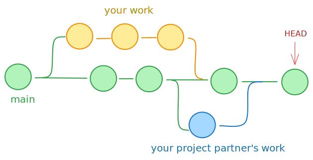

---

# Branches

How?

- Create a new branch

  ```sh
  git branch foo
  ```

- You have 2 different options of changing your current branch to the new one

  ```sh
  git checkout foo
  git switch foo
  > Switched to branch 'foo'
  ```

- View all your local branches with `git branch`

  ```sh
  * foo
    main
  ```

  <small>The \* marks your current branch</small>

---

# Branches

What?

Let's create another file and commit it to our new branch

```sh
touch another.md && git add . && git commit -m "another commit
```

Now, what happened?

```sh
git log --oneline
> d4ee3ee (HEAD -> foo) 2nd commit
> ea7aad1 (main) test
```

If we switch back to _main_, we can't see the new commit:

```sh
git checkout main
> Switched to branch 'main'
git log --oneline
> ea7aad1 (HEAD -> main) test
```

We can make changes to _main_ branch as if our change on _foo_ never existed!

---

# Exercise

~ 5 minutes

1. Create a new branch and switch to it
2. Verify you are on the branch
3. Make two commits on the new branch
4. Verify that your new branch is two commits ahead of _main_

Something like this should be the result:

```sh
62ad496 (HEAD -> foo) 3rd commit
de59c28 2nd commit
2326e5e (main) test
```

We can see that _HEAD_ points to our new branch _foo_ while _main_ is two commits behind.

---

# Merge

Let's say, in the meantime, our colleague worked on a different feature and commited the code to _main_.

```sh
git checkout main
touch new.md
git add .
git commit -m "4th commit"
git log --oneline
```

This is the _main_ branch now:

```sh
fdadab0 (HEAD -> main) 4th commit
2326e5e test
```

How can we get our work from _foo_ to _main_?

---

# Merge

How can we get our work from _foo_ to _main_?

By **merging** the **source** branch (_foo_) into the **target** (_main_) branch:

```sh
git merge foo
```

The branch you're on is the _target_ branch and the branch you're specifying in `git merge <branchname>` is your _source_ branch.

Upon merging, you should choose an informative commit message:

```sh
  0 Feat: This is a great feature
  1
  2 # Please enter a commit message to explain why this merge is necessary,
  3 # especially if it merges an updated upstream into a topic branch.
  4 #
  5 # Lines starting with '#' will be ignored, and an empty message aborts
  6 # the commit.
```

When working in larger codebases, there is usually some [naming convention for merge commits](https://www.conventionalcommits.org/en/v1.0.0/#summary) (e.g. feat, fix, chore, ...).

---
layout: two-cols-header
---

# Merge

What happened? Let's check with `git log --graph`

::left::

```sh
*   commit e15bddaf5515a5b89c04a1e9085718e8a81b0b4e (HEAD -> main)
|\  Merge: fdadab0 62ad496
| |
| |     Feat: This is a great feature
| |
| * commit 62ad496a99fd8c6be44cbe28e21747c85b8b54ae (foo)
| |
| |     3rd commit msg
| |
| * commit de59c2813ebe259e7d1fa91ccd83228fbd0e52c5
| |
| |     2nd commit msg
| |
* | commit fdadab02a0a1b9a282a8fd30f97221434a999c5d
|/
|       4th commit msg
|
* commit 2326e5eed074c32710ff3ff7d785b17eee2ee4f1

      1st commit msg
```

::right::

<div style="margin-left: 20px">

<br>

A merge is attempting to combine two histories together that have diverged at some point in the past (here: after the first commit).

git then merges the sets of commits onto the common ancestor (merge base) and creates a new commit (merge commit) at the tip of the branch that is being merged on with all the changes combined into one commit.

During this, a [merge conflict](https://docs.github.com/en/pull-requests/collaborating-with-pull-requests/addressing-merge-conflicts/resolving-a-merge-conflict-using-the-command-line) can occur. More on that later.

</div>

---

# Reflog

Lost your _HEAD_ and trying to find it?

Using `git reflog` you can see where your `HEAD` has been previously. Each point in time (i.e. a checkout, commit, etc.) has it's own unique SHA.

```sh
e15bdda (HEAD -> main) HEAD@{0}: merge foo: Merge made by the 'ort' strategy.
fdadab0 HEAD@{1}: merge foo: updating HEAD
fdadab0 HEAD@{2}: commit: 4th commit
2326e5e HEAD@{3}: checkout: moving from foo to main
62ad496 (foo) HEAD@{4}: commit: 3rd commit
...
```

Let's create a new branch, commit something to it and delete the branch:

```sh
git checkout -b new-to-be-deleted
touch new-to-be-deleted.md && git add . && git commit -m "lost commit"
git checkout main
git branch -D new-to-be-deleted
```

Can we bring back our lost commit?

---

# Cherry pick

Bringing back our lost commit

Let's check where our _HEAD_ has been with `git reflog`

```sh
git reflog
> e15bdda (HEAD -> main) HEAD@{0}: checkout: moving from new-to-be-deleted to main
> 5f5bcec HEAD@{1}: commit: lost commit
> e15bdda (HEAD -> main) HEAD@{2}: checkout: moving from main to new-to-be-deleted
```

Our lost commit, along with it's SHA is still available! Using `git cherry-pick <SHA>` we can bring it back to the branch that we are currently on (if history didn't diverge too much):

```sh
git cherry-pick 5f5bcec
git log --oneline
> d589cc2 (HEAD -> main) lost commit
> e15bdda Feat: This is a great feature
> fdadab0 4th commit
> 62ad496 (foo) 3rd commit
```

Great! Our _HEAD_ now points to the commit that we've thought to be lost.<br>
<small>Remember: You can learn more about `cherry-pick` just like with any other command using `git cherry-pick --help`</small>

---

# Reset

Time travel has never been so easy

Using `git reset <SHA>` you can reset your _HEAD_ to any previous point SHA from `log` or `reflog`.

Say, you decide that you don't want to keep the commit that we just recovered. You can just move back to the commit before it!

```sh
git log --oneline
> d589cc2 (HEAD -> main) lost commit
> e15bdda Feat: This is a great feature
...
```

```sh
git reset e15bdda
> HEAD is now at e15bdda Feat: This is a great feature
```

But wait... Why are there uncommited files now?

```sh
git status
> On branch main
> new file:   new-to-be-deleted.md
```

---

# Reset

Why are there uncommited files now?

```sh
git status
> On branch main
> new file:   new-to-be-deleted.md
```

This is the exact file which we added via the commit that we just got rid of!

The file is still there, because `git reset` does a _soft_ reset per default (= `git reset --soft`). This keeps the files from the removed commits in our staging area. It's a safety feature that prevents us from losing our work unintentionally.

However, in this case, we want to remove the commit **along** with all it's changes. We can achieve this with the `--hard` flag. Use with caution!

```sh
git reset --hard e15bdda
git status
> On branch main
> nothing to commit, working tree clean
```

---

# Reset

a word of caution

This commands does something that is commonly called [rewriting history](https://git-scm.com/book/en/v2/Git-Tools-Rewriting-History).

Only rewrite history on **your own branches**! These include branches that are one of the following:

- Not published yet (= you did not use `git push` yet)
- Others will definitely not base their work on top of your branch (e.g. a feature-branch that **only you** are working on)

---

# Exercise

~ 10 minutes

1. Merge _foo_ into _main_
2. Explore the git log and highlight the different branches
3. Make some changes to main and commit them
4. Delete the commit you've made
5. Verify that _HEAD_ now points to your merge commit again
6. "Undo" the deletion and bring back the commit
7. Verify that _HEAD_ now points to the brought-back commit
8. Bonus: Explore different options for the new commands you just learned

---

# Remote

Let's start collaborating!

_Remote_ just means that there is a copy of your local git repo accessible _somewhere_ else! Typically, remotes are hosted on [GitHub](https://github.com/), [GitLab](https://gitlab.com/), [Bitbucket](https://bitbucket.org/) and so on. However, there are plenty of other options and you certainly don't need any of these big players. You can even [host your own git server](https://eklitzke.org/how-to-host-your-own-private-git-repositories) if you like.

For the sake of simplicity, we will use GitHub for this course. If you've followed the requirements, you should already have set it up.

1. [Create an **empty** repo on GitHub](https://github.com/new)
2. Add the remote to your repo as a "source of truth". A common naming convention for such remote repos is _origin_: <br> `git remote add origin git@github.com:<YOUR-USER-NAME>/<YOUR-REPO-NAME>.git`
3. Push your local changes (for once) on main upstream: <br> `git push -u origin main`
4. Now you should be able to see your files and commits in the browser!

---
layout: two-cols-header
---

# GitHub

has some neat features

The cool thing about using GitHub (or any other established hosting service) is that it comes with a lot of features in addition to version control.

::left::

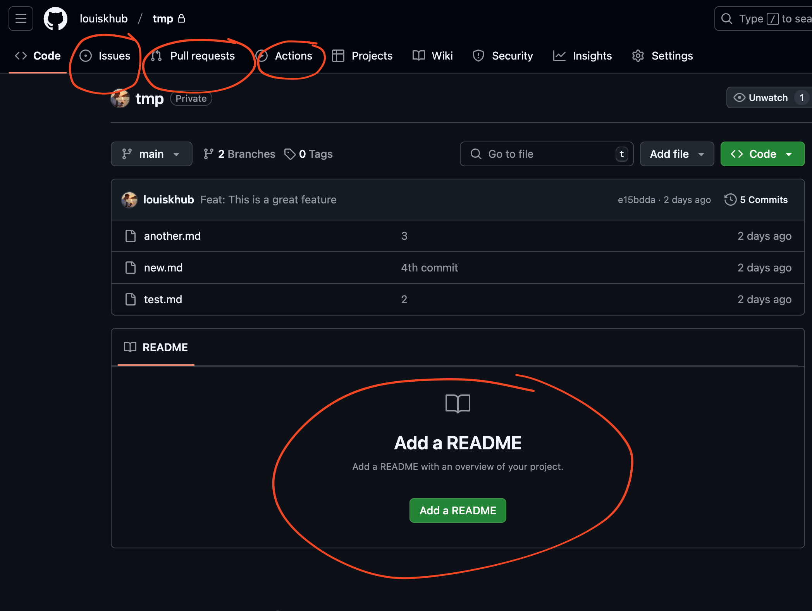

::right::

<div style="margin-left: 20px">

- We can write [issues](https://docs.github.com/en/issues/tracking-your-work-with-issues/about-issues) to track ideas, feedback, tasks, or bugs
- We can create [pull requests](https://docs.github.com/en/pull-requests/collaborating-with-pull-requests/proposing-changes-to-your-work-with-pull-requests/about-pull-requests) for our contributions
- We can automate tasks with [actions](https://docs.github.com/en/actions)
- Small hints, etc. (e.g. we are immediately reminded to upload a README)

</div>

---

# Exercise

~ 5 min

Create a new branch along with 3-4 commits.

1. In the first commit you add some text to your existing files
2. In the second commit, you delete some of the text you just added.
3. In the third commit, you add a README.md file with some content (can be any [markdown](https://en.wikipedia.org/wiki/Markdown) text)
   In the first commit. In the other commits, you can add/delete more text and files.

After this, push the branch upstream. Hint: you first have to link an upstream branch to your local branch in order to do this:

```sh
 git push --set-upstream origin "<YOUR-BRANCH-NAME>"
```

Now, you should see a notification on GitHub which tells you that there has been a push to your new branch.


---

# Rewriting history on a public branch

and how git tries to protect you

Say, after we already pushed our changes upstream (i.e. made our branch public), we decide to remove a commit. As mentioned previously, this can be done via `git reset <SHA>` but **it rewrites history**.

Git implements some guardrails that prevent you from accidentally pushing a diverged git history and potentially overwriting someones work:

```sh
git push -u origin bar
> ! [rejected]        bar -> bar (non-fast-forward)
> error: failed to push some refs to 'github.com:louiskhub/tmp.git'
> hint: Updates were rejected because the tip of your current branch is behind
> hint: its remote counterpart. Integrate the remote changes (e.g.
> hint: 'git pull ...') before pushing again.
```

If you're absolutely sure no one will use your public branch until it's merged into _main_, you can force git to push your changes with the `--force-with-lease` flag:

```sh
git push -u origin bar --force-with-lease
```

---
layout: two-cols-header
---

# Exercise: Issue & Pull Request

~ 4 min

::left::

<div style="padding-right: 10%">

1. [Create a new issue](https://github.com/louiskhub/tmp/issues/new?template=Blank+issue) where we specify some arbitrary requirements for a feature
2. Create a pull request (PR) from your new branch to _main_
3. Link the issue in the PR description

</div>

::right::

<video controls autoplay>
  <source src="../assets//github/issue2pr.mp4" type="video/mp4">
</video>

---

# Code review

Why it is important (with descending priority)

1. **Distributing code ownership**<br>
   The reviewer has to answer the question: "If the person who wrote this code leaves the team, would you be okay with maintaining the code?".
2. **Ensure proper documentation and minimal complexity**<br>
   If the reviewer has a really hard time understanding the code, it's probably too complex and/or required (more) documentation.
3. **Test if everything works as expected**<br>
   Many larger companies have dedicated [QA](https://en.wikipedia.org/wiki/Quality_assurance) teams and testing is not the reviewer's responsibility. Also, if there is good automated [test coverage](https://en.wikipedia.org/wiki/Black-box_testing#Test_coverage), manual testing is quick and straightforward. However, both is usually not the case in startups!
4. **Find potential [vulnerabilities](<https://en.wikipedia.org/wiki/Vulnerability_(computer_security)>) and bugs**<br>
   It's really hard to catch subtle bugs while trying to keep review-time managable. Hence, this is not the main benefit of review.

---

# Code review

How to do it properly

1. Get the author to [self-review](https://mtlynch.io/code-review-love/#1-review-your-own-code-first) the code before you even look at the PR
2. Keep **the reasons** for code review in mind
3. Read the PR description
4. Read corresponding issue/ticket and check if basic requirements are met by the PR
5. Manually test the feature (if there is no dedicated QA) for bugs
6. Step through the commit history to understand the changes on a **high level**
7. Check out the code locally and use your editor to deep dive into sections that deserve more attention
8. Ask questions and write comments about **stuff that matters** (no [nits](https://graphite.dev/blog/what-are-nits))

<!--
Show example repo here and go through the individual steps
-->

---
layout: two-cols-header
---

# The lie of small PRs

and what you can do to cope

::left::

<div style="padding-right: 10%">

Small PRs are much easier to review. Large PRs introduce a kind of _code review fatigue_.

Try to keep PRs small and compact.

Often, this is impossible! In those cases, make sure the PRs changes are within a well-defined **context**!

Additionally, having an [atomic commit history](https://en.wikipedia.org/wiki/Atomic_commit#Atomic_commit_convention) helps a lot with review.

</div>

::right::


<small><a href="https://www.reddit.com/r/ProgrammerHumor/comments/sa6tls/lgtm/">r/ProgrammerHumor</a></small>

<!--
Show huge diff of [interview booking PR](https://github.com/4eign-talents/platform/pull/452) and talk about what makes a large PR good
-->

---
layout: two-cols-header
---

# Atomic commit history

makes a code review so much easier

> = series of commits where each commit represents a single, complete, and independent change that maintains a working codebase.

This makes it much easier for the reviewer to step through small changes once at a time rather than everything at once!

<!--
Show [interview booking PR](https://github.com/4eign-talents/platform/pull/452) as example
-->

::left::

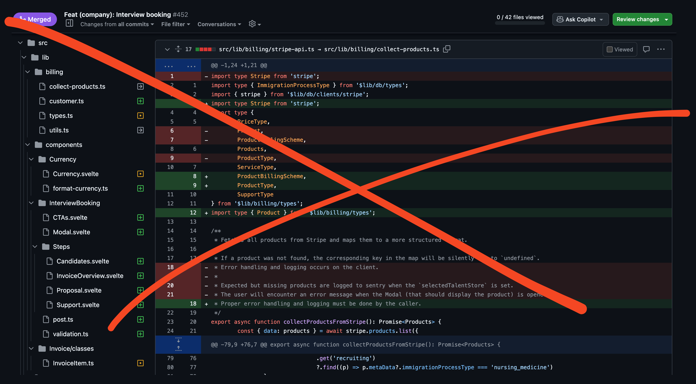

::right::

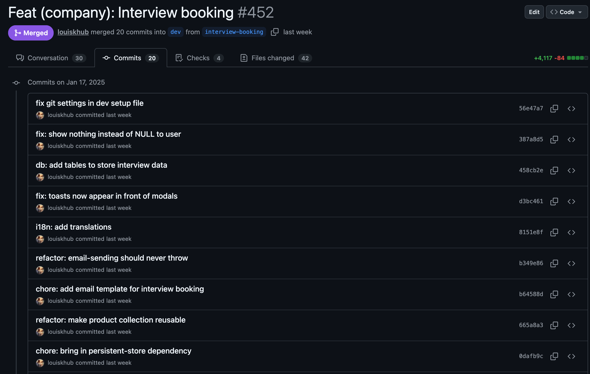

---

# Question

What could we improve about our PRs commits to make them easier to review?

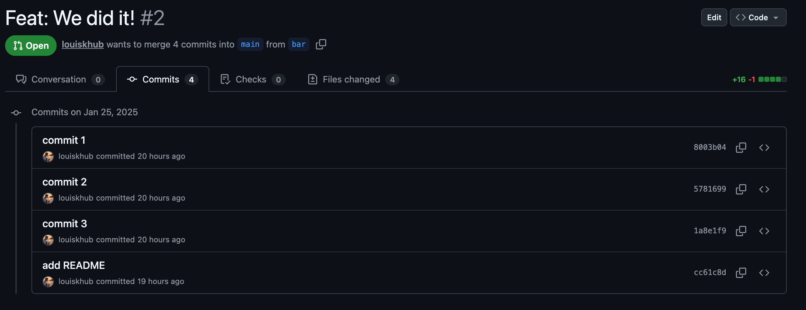

---
layout: two-cols-header
---

# Answer

What could we improve about our PRs commits to make them easier to review?

1. Use descriptive commit messages (maybe even with a standardized naming convention)
2. Don't make changes in some commits that you undo in a later commit!

E.g. in _commit 1_ we add a line in the `test.md` file that we remove in _commit 2_:

::left::

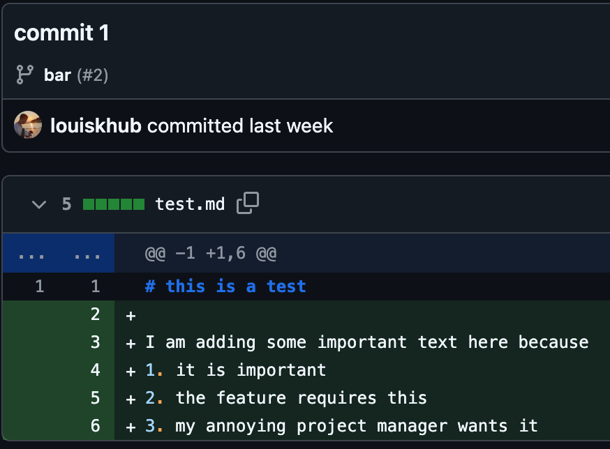

::right::

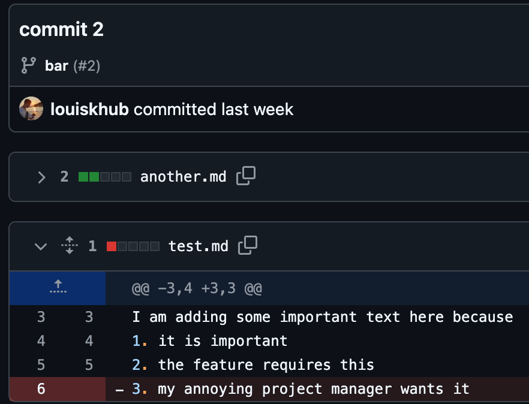

---
layout: two-cols-header
---

# A workflow for getting a nice commit history

The reviewer expectation differs from reality during implementation

::left::

**Problem:**
During implementation, it's hard to maintain a nice commit history (especially if there's a lot of _trial and error_)

**Solution:**
Random commits just to backup your work. No one, except you, needs to understand them. You can also push these to an unused branch of your _remote_.

**Implementation finished?**<br>
&rarr; Use `git reset --soft` with the `SHA` of the last decent commit that you want the reviewer to see (usually the last commit of the branch where you've based your new branch on).

::right::

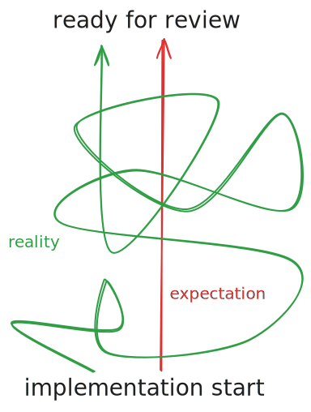

---
layout: two-cols-header
---

# A workflow for getting a nice commit history

Implementation is finished, now what?

::left::

1. Use `git reset --soft` with the `SHA` of the last decent commit that you want the reviewer to see (usually the last commit of the branch where you've based your new branch on).

2. Group your changes into [atomic commits](https://en.wikipedia.org/wiki/Atomic_commit#Atomic_commit_convention).

   - Think about the changes you've made and how to group them into different contexts
   - Combine this with [self-review](https://mtlynch.io/code-review-love/#1-review-your-own-code-first) of your code and check for unnecessary complexity

3. Use `git push --force-with-lease` to rewrite the history on **your** remote branch

::right::


---

# A nice tool for (self)-review

Or how to get a nice [diff](https://en.wikipedia.org/wiki/Diff)

Viewing and commit all your changes via the CLI (`git diff`) can be hard. Your [IDE](https://en.wikipedia.org/wiki/Integrated_development_environment) likely has a diff view that makes it easier to compare large amounts of changes. Below is an example from [VSCode](https://code.visualstudio.com/).

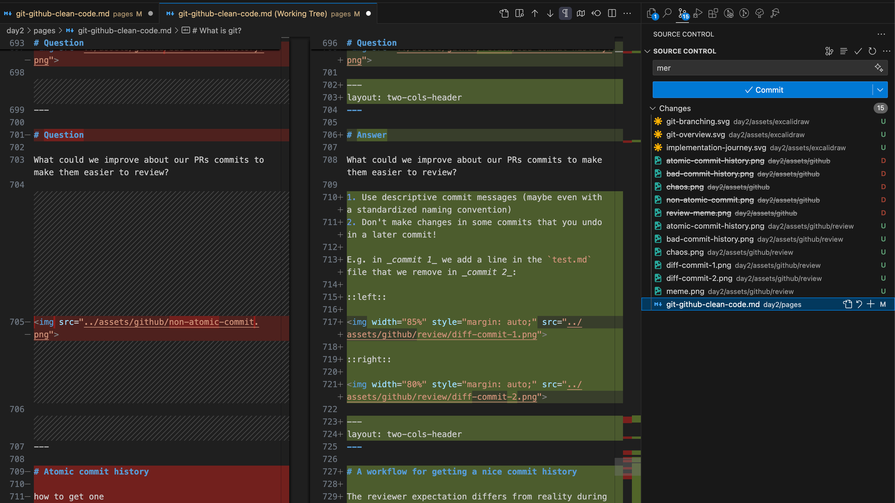

---

# Resolving conflicts

`main` changed, now what?

Previously, [merge conflicts](https://docs.github.com/en/pull-requests/collaborating-with-pull-requests/addressing-merge-conflicts/resolving-a-merge-conflict-using-the-command-line) were briefly mentioned. This happens a lot if you work with multiple devs on one project and it's _essential_ to know how to resolve them.

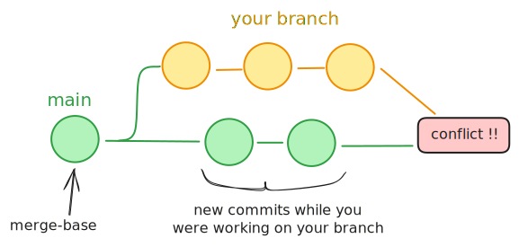

The new commits on _main_ included some changes that conflicted with the work you did on your branch.

---

# Resolving conflicts

Tips and tricks

Some remotes like GitHub enable you to resolve conflicts directly in the browser.

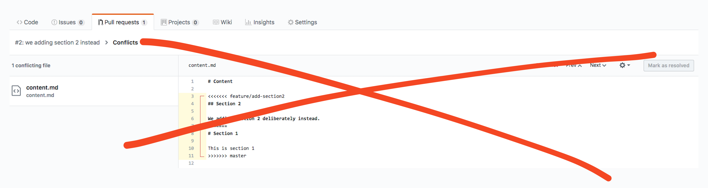

Avoid this! You generally have much less control over what you are doing and it's easier to make mistakes.

Instead, do it locally. First, we have to fetch all new changes from the remote with `git fetch origin`.

---

# Resolving conflicts

Tips and tricks

After we fetched all changes, we can either use `git merge <branch>` or `git rebase <branch>`.<br>
Here, `<branch>` is the name of the branch you want to integrate the changes from.

What is the difference between merging and rebasing?

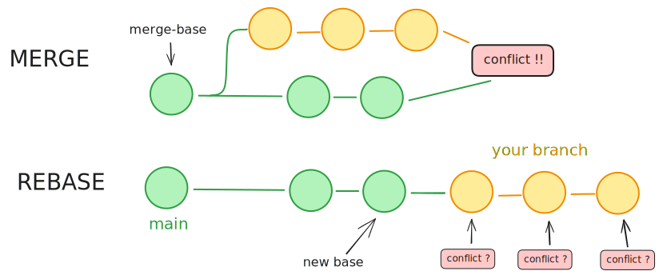

---

# Rebasing can resolve your PR's conflicts

This creates a _linear_ history and may force you to rewrite some commits

When should you prefer `rebase` over `merge`?

Rebasing _rewrites history_ (if you have a merge conflict that needs to be resolved). As mentioned previously, this should never be done on branches that are used by other devs!<br>
This is also the reason why rebasing is considered "dangerous" and [avoided by some devs](https://jvns.ca/blog/2023/11/06/rebasing-what-can-go-wrong-/).

However, on **your own** feature branch, that is about to be merged as a PR, rebasing can be a really nice option because there won't be a merge commit and our nice atomic commit history is preserved!

For large, complex PR's with multiple conflicts, a merge commit can get messy and will be hard to understand in the future. Rebasing forces you to adapt the individual commits that are affected by the conflicts.

This might mean more work for you but could save your mates and future-self a lot of time!

---

# A nice tool for resolving conflicts

is again (drum roll): Your [IDE](https://en.wikipedia.org/wiki/Integrated_development_environment)!

Your IDE likely has some built in tooling to visualize and resolve conflicts much more easily than in the CLI. Below is an example from [VSCode](https://code.visualstudio.com/).

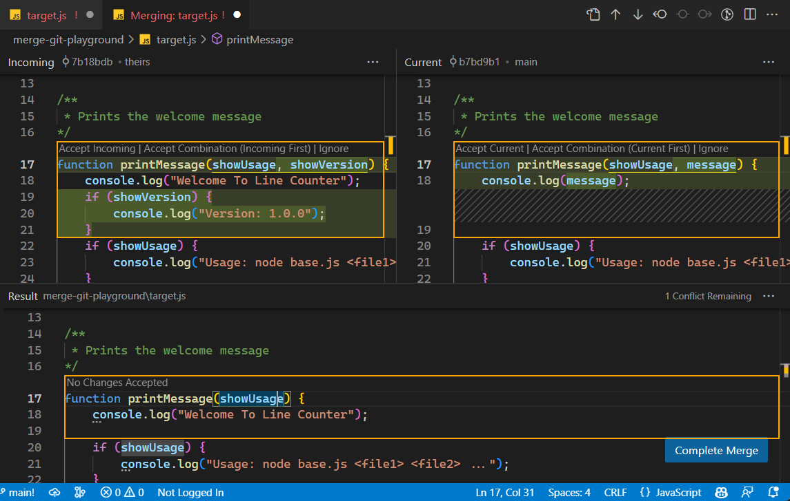

---

# Going full circle

Why Jupyter Notebooks suck for production

They yield gruesome `diff`'s. Good luck trying to resolve conflicts!


To be fair: There are tools (e.g. [nbdime](https://nbdime.readthedocs.io/en/latest/)) that make _diffing_ easier for Jupyter Notebooks. However, these tools also come with there caveats.

---
layout: two-cols-header
---

# There is a looooot more to learn about git

But that's enough for today

::left::

As with most larger tools, one will hardly ever understand every little detail of git.

That's no problem at all.

Just never stop learning and exploring! This is what makes the best developers.

::right::


<small><a href="https://de.wikipedia.org/wiki/Rabbit_Hole#/media/Datei:Down_the_Rabbit_Hole_(311526846).jpg">wikipedia</a></small>
