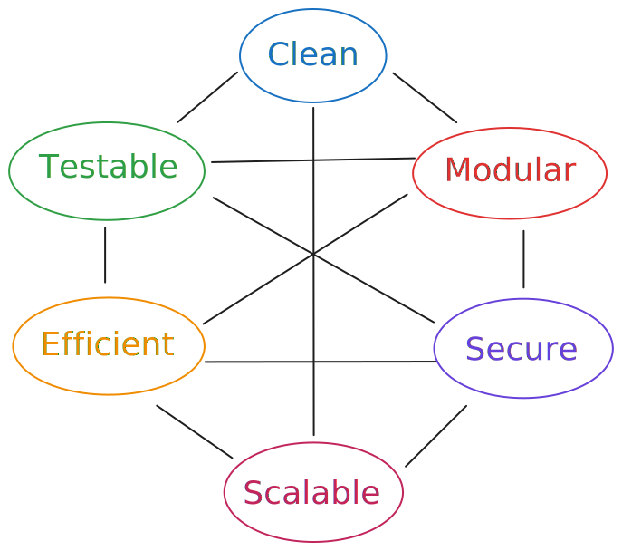

# Qualities of "good code"

All components relate to each other. Some example relations:

::left::

- _Modular_ code is easier to _test_ and to _scale_ but **might** be not as _efficient_.
- _Clean code_ **might** be hard to _test_ if only the understandability of the code is considered. Some things should be separately testable but it would be easier for the reader if they were closely entangled in the same function.
- _Efficient_ code might not be _clean_ (i.e. understandable) because of heavy optimization.

::right::

---

# Testing
