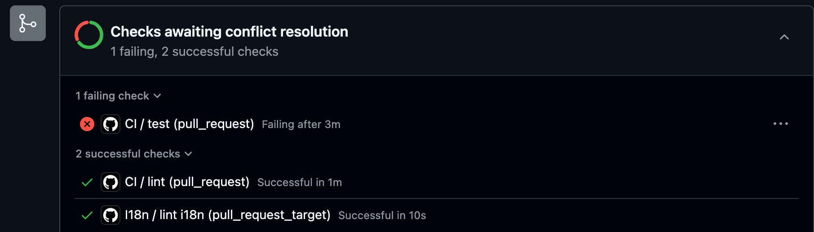

# Clean code

_Rough_ agenda:

1. Definition
2. General advice
3. Formatting & Linting

---
layout: two-cols-header
---

# Definition

::left::

<blockquote>
  Code is clean if it can be understood easily – by everyone on the team.<br><br>
    Clean code can be read and enhanced by a developer other than its original author. With understandability comes readability, changeability, extensibility and maintainability.
</blockquote>

<br>

The term was coined by <a href="https://en.wikipedia.org/wiki/Robert_C._Martin">Robert C. Martin</a>'s book. It contains some really solid advice but also some polarizing opinions.

Don't be dogmatic about anything when it comes to this topic! It's very easy to fall for this trap and get hung up in pointless arguments.

::right::


---

# General advice

1. Follow standard conventions.
2. KISS: Keep it simple stupid. Simpler is always better. Reduce complexity as much as possible.
3. Scout rule: Leave the campground cleaner than you found it.
4. Always look for the root cause of a problem.

---

# General advice

Follow standard conventions

For Python, a widely used convention is the language's [official styleguide PEP 8](https://peps.python.org/pep-0008).

It's not necessary that you strictly follow exactly this exact styleguide!

Especially for smaller projects you might not even need a styleguide at all. However, if we talk about any larger production codebase that actively maintained by many developers: It's really handy to have one.

<br>

How to ensure that everyone follows the styleguide?

Option 1: During code review. <br>
=> Annoying for both the reviewer and the dev. Both end up hating each other.

Option 2: Automate it using: [Linting](<https://en.wikipedia.org/wiki/Lint_(software)>) and Formatting! <br>
=> This will catch most convention-breaking code. The rest is up to the reviewer.

---
layout: two-cols-header
---

# Linting and formatting

How?

For Python, we recommend to take a look at [ruff](https://docs.astral.sh/ruff). It's a useful all-in-one tool. Not so long ago, you had to use a bunch of different tools ([Flake8](https://flake8.pycqa.org/en/latest), [Black](https://github.com/psf/black), [isort](https://pypi.org/project/isort) and more) for this!

::left::

**Linter** output:

<div style="padding-right: 30px">

```sh
uv run ruff check
```

```sh
> main.py:1:16: F401 [*] `os.path` imported but unused
>   |
> 1 | from os import path
>   |                ^^^^ F401
>   |
>   = help: Remove unused import: `os.path`
>
> Found 1 error.
> [*] 1 fixable with the `--fix` option.
```

</div>

::right::

**Formatter** in action:

````md magic-move
```python
from os import path
num_terms    =10
result= calculate_fibonacci(  num_terms)
for i,         num in         enumerate(result):
  print(f"Term {i+1}: {num     }")

def calculate_fibonacci(n):
    if n <= 0:
                return []
    elif n == 1:
        return [0]
    sequence = [0, 1]
    while len(sequence) < n:
                    sequence.append(sequence[-1] + sequence[-2])
    return     sequence
```

```python
from os import path

num_terms = 10
result = calculate_fibonacci(num_terms)
for i, num in enumerate(result):
    print(f"Term {i + 1}: {num}")

def calculate_fibonacci(n):
    if n <= 0:
        return []
    elif n == 1:
        return [0]
    sequence = [0, 1]
    while len(sequence) < n:
        sequence.append(sequence[-1] + sequence[-2])
    return sequence
```
````

---
layout: two-cols-header
---

# Linting and formatting

When?

### Formatting

A popular choice is: format on file-save. If you're using [VSCode](https://code.visualstudio.com/), you can easily use an extension for this.

### Linting

This is more tricky. We can easily run `ruff check` but how do we ensure to not forget it from time to time?

You can set up a [githook](https://git-scm.com/docs/githooks#_pre_commit) that checks for linter-errors before every `git commit` or `git push`.<br>
Now you can be sure that **you** don't forget about linting.

::left::

But what about other devs? You can't force them to set up githooks on their local machine. <br>
This is where [GitHub Actions](https://github.com/features/actions) shine. You can use them to check for linter-errors upon pull requests. This is part of [continuous integration (CI)](https://en.wikipedia.org/wiki/Continuous_integration).

::right::

<div style="display: flex; align-items: center; height: 100%;">
  
</div>

---

# General advice

[KISS: Keep it simple stupid](https://en.wikipedia.org/wiki/KISS_principle)

<blockquote>= Don't unnecessarily complicate things if there is an easier way to do it.</blockquote>

The definition of _complicated_ may vary within and across teams. Maybe you are a Python wizard/witch but:

1. is everyone else who's currently in your team?
2. will the future maintainer of the your code understand it?
3. do you really need 3 nested [dict-comprehensions](https://peps.python.org/pep-0274) ?!

<br>

More often than not, it's actually harder to write _simple_ code rather than _complicated_ code. It forces you have an in-depth understanding of what your are doing. There are whole programming languages based on this principle (e.g. [Go](https://go.dev/)).

<br>

<blockquote>Simplicity carried to an extreme becomes elegance.</blockquote>
<small style="padding-left: 10px">-- Jon Franklin (i think)</small>

---

# General advice

Scout rule: Leave the campground cleaner than you found it.

If you contribute to a codebase and you stumble accross some [legacy](https://en.wikipedia.org/wiki/Legacy_system#:~:text=Legacy%20code%20is%20old%20computer,obsolete%20or%20supporting%20something%20obsolete.) or buggy code: Make an effort to [refactor](https://en.wikipedia.org/wiki/Code_refactoring) it!

It does not matter if you wrote the old code or somebody else.

---

# General advice

Always look for the root cause of a problem.

This mainly applies to bug fixing. Trying to fix a bug only by fixing it's symptoms, will only lead to the bug popping up again a few days later.

You can also translate this advice into other areas. E.g. product management: <br>
If your users are not using your shiny new feature, find out why and don't force them to use it!

---

# Most comments are overrated

Use self-documenting code instead

A very basic example for this is proper function and variable names. Just be descriptive in your naming:

````md magic-move
```python
def calc(n, t):
    # Calculates total price after tax
    return n * (1 + t/100)
```

```python
def calculate_price_with_tax(base_price, tax_rate):
    return base_price * (1 + tax_rate/100)
```
````

<br>

> Content recommendation: [This video](https://youtu.be/Bf7vDBBOBUA?feature=shared) goes into more detail about exactly this topic.

---

# Most comments are overrated

Proper typing is sometimes enough!

````md magic-move
```python
def merge_user_data(users, profiles):
    """
    Combines user accounts with their profile information.
    users: list of dicts with 'id' and 'email'
    profiles: list of dicts with 'user_id' and 'bio'
    returns: list of complete user records
    """
    lookup = {p['user_id']: p['bio'] for p in profiles}
    return [{**user, 'bio': lookup.get(user['id'], '')} for user in users]
```

```python
from typing import List, Dict, TypedDict

class PartialUser(TypedDict):
    id: int
    email: str

class Profile(TypedDict):
    user_id: int
    bio: str

class User(TypedDict):
    id: int
    email: str
    bio: str

def merge_user_data(users: List[PartialUser], profiles: List[Profile]) -> List[User]:
    lookup = {p['user_id']: p['bio'] for p in profiles}
    return [{**user, 'bio': lookup.get(user['id'], '')} for user in users]
```
````

<br>

For more advanced use cases, [Pydantic](https://docs.pydantic.dev) models are really useful. More on that later!

---

# Most comments are overrated

but sometimes you really need them

<br>

Sometimes, there really is no way to improve your code (especially given time constraints) but you feel like some important information is missing. <br>
=> Commenting is good in this case

However, most of the time if you can't rewrite or enhance your code to make comments redundant: <br>
Your whole problem-solving approach is probably flawed and you should look for an entirely different way to code the solution.

---

# [DRY](https://en.wikipedia.org/wiki/Don%27t_repeat_yourself) is overrated

The DRY principle stands for: Don't repeat yourself

Of course, you should make use of it for obvious cases:

````md magic-move
```python
def welcome_john():
    print("Hello John!")
    print("Welcome to our app!")
    print("Enjoy your stay!")

def welcome_mary():
    print("Hello Mary!")
    print("Welcome to our app!")
    print("Enjoy your stay!")
```

```python
def welcome(name):
    print(f"Hello {name}!")
    print("Welcome to our app!")
    print("Enjoy your stay!")
```
````

---

# [DRY](https://en.wikipedia.org/wiki/Don%27t_repeat_yourself) is overrated

"Duplication is far cheaper than the wrong abstraction" -- [Sandi Metz](https://youtu.be/8bZh5LMaSmE?feature=shared&t=2140).

<small>

1. Programmer A sees duplication.
2. Programmer A extracts duplication and gives it a name. <br>
   => This creates a new abstraction. It could be a new method, or perhaps even a new class.
3. Programmer A replaces the duplication with the new abstraction. <br>
   => Ah, the code is perfect. Programmer A trots happily away. Time passes.

4. A new requirement appears for which the current abstraction is almost perfect. Programmer B gets tasked to implement this requirement. <br>
   => Programmer B feels honor-bound to retain the existing abstraction, but since isn't exactly the same for every case, they alter the code to take a parameter, and then add logic to conditionally do the right thing based on the value of that parameter. <br>
   => What was once a universal abstraction now behaves differently for different cases.
5. Another new requirement arrives.
   => Programmer X. Another additional parameter. Another new conditional. <br>
   => Loop until code becomes incomprehensible.
6. YOU ARE HERE => Don't fall for the [sunken-cost-fallacy](https://en.wikipedia.org/wiki/Sunk_cost#Fallacy_effect) and just use code duplication instead of wasting time!

</small>

---
layout: two-cols-header
---

# More advice

There are a lot more good habits you can learn

::left::

<br>

[_Very_ brief summary of "Clean Code" by Robert C. Martin](https://gist.github.com/wojteklu/73c6914cc446146b8b533c0988cf8d29)

Most of these things have room for interpretation and a lot is biased by personal preference.

Always question if someone tells you there is only a single way to do something without giving a good argument. Even if the person is (supposedly) more experienced.

::right::

<div style="padding-left: 20px">

<small><a href="https://de.wikipedia.org/wiki/Rabbit_Hole#/media/Datei:Down_the_Rabbit_Hole_(311526846).jpg">wikipedia</a></small>
</div>
