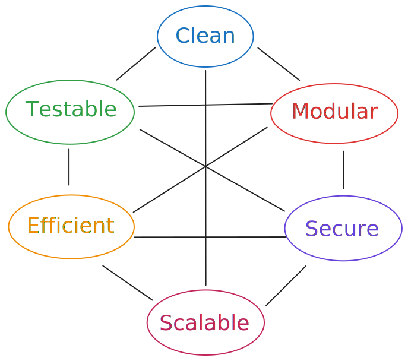

# Reality check: What is "good software"?

Clean code is (by far) not the most important thing

As soon as you are working on an actual, real product, there are more important things than clean code:

1. Functional excellence - If software doesn't solve the actual problem or work reliably, nothing else matters.
2. User experience - Software exists to serve users.
3. Business alignment (if you work at a company or found your own)
4. Technical quality
5. Long-term sustainability (including "clean code")

<br>

In an ideal world, all of these are ensured. In reality, you often need to make tradeoffs.

---
layout: two-cols-header
---

# Qualities of "good code"

All components relate to each other. Some example relations:

::left::

- _Modular_ code is easier to _test_ and to _scale_ but **might** be not as _efficient_.
- _Clean code_ **might** be hard to _test_ if only the understandability of the code is considered. Some things should be separately testable but it would be easier for the reader if they were closely entangled in the same function.
- _Efficient_ code might not be _clean_ (i.e. understandable) because of heavy optimization.

::right::



---

# Automated Testing

_Rough_ agenda:

1. Why you should do it
2. When you shouldn't do it
3. How to write testable code
4. Different types of tests
   - in general software development (e.g. web)
   - in machine learning / AI
5. Test coverage

<br>
<br>
<br>
<small>If I refer to just "testing" in the following slides, I always mean <b>automated</b> testing.</small>

---

# Why you should do automated testing

Catch Bugs Early

This is true for any field of software development. Example scenarios:

### In app development

Imagine you roll out an app for your users. If your users find bugs, you need to fixe them **immediately** and everything will be really stressful.

### In machine learning

Imagine you you have a large model to train and you want to do that on some [GPU cluster](https://en.wikipedia.org/wiki/GPU_cluster) (more on that later). Most GPU clusters are used by multiple engineers / researchers. <br>
To handle the requested workload properly, the cluster is controlled via a job scheduling system (e.g. [Slurm](https://en.wikipedia.org/wiki/Slurm_Workload_Manager)) which makes sure everyones code is executed is a fair manner. During high load, you might have to wait several hours before you can even start to train your model!

You will be really annoyed if your training run stops (or does not even start) because of an unexpected error after waiting so long for your turn. <br>
Testing _can_ spare you this experience!

---

# Why you should do automated testing

Increase developer confidence

Imagine you developed complicated piece of code. <br>
<small>As said during the _clean code_ section, you should generally avoid this but sometimes you can't (e.g. when doing ML, you need some heavy math here and there).</small>

Other people on your team will <br>
(A) have a hard time to understand what the code does <br>
(B) be afraid to modify it

If you have written proper tests alongside your code, they will fail as soon as your teammate breaks the code! They can then see what went wrong, fix it and maybe also update the tests.

This gives your team confidence to touch your code and prevents [information silos](https://en.wikipedia.org/wiki/Information_silo).

In some sense, good tests are also a form of self-documentation that replaces the need for comments (a beautiful circle back to _clean code_).

---

# Why you should do automated testing

It saves you time

At first glance, it may seem like writing tests takes too much time.

Short term, this may be the case. But in the long run, manual testing and making your your code does not break with new features takes much more time! <br>
Of course, this only matters if you plan to maintain the code for an extended period of time. In the fast paced software and ML world, _extended period of time_ can mean as little as a couple of months!

---

# When you shouldn't do automated testing

If your code is work-in-progress or just a quick prototype

Tests require modular code with well-defined behaviour. This is something that is very hard to achieve during active development. It does not make much sense to write tests for spaghetti code that will change anyways (in a few hours or days).

Note that this is an opinionated topic.

There is also a concept called [Test Driven Development (TDD)](<https://en.wikipedia.org/wiki/Test-driven_development#:~:text=Test%2Ddriven%20development%20(TDD),with%20another%20new%20test%20case.>) but it's really hard to get right. The philosophy of _TDD_ is entirely opposite to what I just told you: Write your tests first, then write your code.

### Why is TDD hard?

> The main prerequisite for testable code is to have **clear expectations of your code**.

Often, when you start working on something, the requirements are not perfectly clear and you figure them out as you go. This is especially the case in research and startups.

=> If you are inexperienced in TDD and want to **iterate fast**: Don't do TDD. <br> Nevertheless it's interesting. [You should read about it](https://hn.algolia.com/?q=tdd) and maybe try it out when hacking on pet projects.

---

# Test types

These are the most popular and common ones:

1. **Unit tests** verify that individual code components work correctly in isolation
2. **Integrations tests** check if different components of a system work together properly
3. **Smoke tests** are a quick check of an application's most critical functions to ensure basic operability
4. **API tests** verify the behavior of software interfaces (e.g. ensuring they handle requests correctly)

My advice today is mostly relevant for unit and integration testing.

There are also more niche and/or advanced test types out there:

- [Contract tests](https://docs.pact.io/) 
- [End-to-End (E2E) tests](https://en.wikipedia.org/wiki/System_testing)
- [Simulation tests](https://www.warpstream.com/blog/deterministic-simulation-testing-for-our-entire-saas)
- Specific to ML: Data tests, pipeline tests, monitoring tests, ...

---

# How to write testable code

Desired properties of your code

### Modularity

Many smaller tests are much easier to maintain than one really large one. You can only have small tests if you have small isolated pieces of code to test!

How to write modular code? There is no quick answer. The next slides contain some guidelines.

### Deterministic outputs

The result of your test should _always be same_, no matter how often you run it.
This can only be the case if the output of the code you test is _always the same_.

How to write deterministic code? Don't include things that can change between test runs in your code!

Examples: random numbers, current time/date, network calls, ...

---

# How to write modular code

Single Responsibility Principle: Each testable function should only do one thing

````md magic-move
```python
# BAD EXAMPLE - This function does too many things at once
class TextProcessor:
    def process_text(self, text: str) -> Dict:
        text = text.lower()
        text = re.sub(r'[^a-zA-Z0-9\s]', '', text)
        
        tokens = text.split()
        
        stop_words = set(['the', 'a', 'an', 'in', 'on', 'at'])
        tokens = [t for t in tokens if t not in stop_words]
        
        vocab = self._build_vocabulary(tokens)
        vector = np.zeros(len(vocab))
        for token in tokens:
            if token in vocab:
                vector[vocab[token]] += 1

        return { 'tokens': tokens, 'vector': vector }
```

```python
# BAD EXAMPLE - This function does too many things at once
class TextProcessor:
    def process_text(self, text: str) -> Dict:
        # Preprocessing
        text = text.lower()
        text = re.sub(r'[^a-zA-Z0-9\s]', '', text)
        
        # Tokenization
        tokens = text.split()
        
        # Stop word removal
        stop_words = set(['the', 'a', 'an', 'in', 'on', 'at'])
        tokens = [t for t in tokens if t not in stop_words]
        
        # Vectorization
        vocab = self._build_vocabulary(tokens)
        vector = np.zeros(len(vocab))
        for token in tokens:
            if token in vocab:
                vector[vocab[token]] += 1

        return { 'tokens': tokens, 'vector': vector }
```

```python
# GOOD EXAMPLE - Following Single Responsibility
class TextCleaner:
    """Responsible only for text cleaning operations"""
    def clean(self, text: str) -> str:
        lowercase_text = text.lower()
        return self._remove_special_chars(text)
    
    def _remove_special_chars(self, text: str) -> str:
        return re.sub(r'[^a-zA-Z0-9\s]', '', text)

class Tokenizer:
    """Responsible only for tokenization"""
    def __init__(self, stop_words: Set[str]):
        self.stop_words = stop_words
    
    def tokenize(self, text: str) -> List[str]:
        tokens = text.split()
        return self._remove_stop_words(tokens)
    
    def _remove_stop_words(self, tokens: List[str]) -> List[str]:
        return [t for t in tokens if t not in self.stop_words]

class Vectorizer: # ...
```
````

---

# How to write tests

1. Make the most important assertions
2. Test for edge cases

<br>

### Text cleaner

- must convert all text to lowercase
- must remove special characters
- must preserve numbers
- must handle an empty string correctly (?)

### Tokenizer

- must split text into tokens
- must remove stop words
- must handle empty string correctly (?)
- must handle string containing only stopwords correctly (?)

---

# How to write tests

1. Make the most important assertions
2. Test for edge cases

<br>

### Text cleaner

- must convert all text to lowercase
- must remove special characters
- must preserve numbers
- <s>must handle an empty string correctly</s> => must return empty string given an empty string

### Tokenizer

- must split text into tokens
- must remove stop words
- <s>must handle empty string correctly</s> => must return empty array given an empty string
- <s>must handle string containing only stopwords correctly</s> => must return empty array ...

---

# How to write tests

```python
@pytest.fixture
def text_cleaner():
    return TextCleaner()

class TestTextCleaner:
    def lowercase_conversion(self, text_cleaner):
        input_text = "Hello World"
        cleaned_text = text_cleaner.clean(input_text)
        assert cleaned_text == "hello world"
    
    def special_character_removal(self, text_cleaner):
        input_text = "Hello! How are you?"
        cleaned_text = text_cleaner.clean(input_text)
        assert cleaned_text == "hello how are you"
    
    def handles_empty_string(self, text_cleaner):
        assert text_cleaner.clean("") == ""
    
    def preserves_numbers(self, text_cleaner):
        input_text = "I have 123 apples!"
        cleaned_text = text_cleaner.clean(input_text)
        assert cleaned_text == "i have 123 apples"
```

---

# How to write tests

```python
@pytest.fixture
def tokenizer():
    stop_words = {'the', 'a', 'an', 'in', 'on', 'at'}
    return Tokenizer(stop_words)

class TestTokenizer:
    def basic_tokenization(self, tokenizer):
        input_text = "hello world"
        tokens = tokenizer.tokenize(input_text)
        assert tokens == ["hello", "world"]
    
    def stop_word_removal(self, tokenizer):
        input_text = "the cat in the hat"
        tokens = tokenizer.tokenize(input_text)
        assert tokens == ["cat", "hat"]
    
    def handles_empty_string(self, tokenizer):
        assert tokenizer.tokenize("") == []
    
    def handles_only_stop_words(self, tokenizer):
        input_text = "the in on at"
        assert tokenizer.tokenize(input_text) == []
```

---

# How to write tests

```python
def test_full_pipeline():
    """
    Integration test showing how components work together
    while maintaining their single responsibilities.
    """
    cleaner = TextCleaner()
    tokenizer = Tokenizer({'the', 'a'})
    
    # Process a sample text through both components
    input_text = "The Cat! The Hat!"
    
    # Each step maintains its single responsibility
    cleaned_text = cleaner.clean(input_text)
    assert cleaned_text == "the cat the hat"
    
    tokens = tokenizer.tokenize(cleaned_text)
    assert tokens == ["cat", "hat"]
```

---

# What else is there to modular code?

Some reading suggestions

The Single Responsibility Principle is important but there is more:

1. Try to write [pure functions](https://en.wikipedia.org/wiki/Pure_function)
2. Deal with dependencies properly. The goal is to isolate them from _our_ code as best as we can. These are a few popular options:
    - [Adapters](https://en.wikipedia.org/wiki/Adapter_pattern)
    - [Dependency injection](https://en.wikipedia.org/wiki/Dependency_injection) (often requires [Mocking](https://stackoverflow.com/questions/2665812/what-is-mocking))
    - [Hexagonal Architecture](https://en.wikipedia.org/wiki/Hexagonal_architecture_(software))

---

# Test coverage

is a frequently used metric to evaluate if a codebase is well tested

> Definition: % of executed source code when running a test suite

Example: For a 50% test coverage, half of the code that exists in a codebase is explicitly or implicitly tested during a test suite.

The most popular tool for measuring this in Python is [Coverage.py](https://github.com/nedbat/coveragepy).

<br>

**Be careful**: it's easy to get a false sense of security when having "good" test coverage.

This is by far not everything that matters. The **quality of your assertions** and **your test data** can be far more important! Sometimes, this correlates with test coverage but not necessarily.<br>
These things are just hard to measure that's why test coverage is often used as a north-star metric.

---
layout: two-cols-header
---

# Writing good tests

takes practice and experience

::left::

<br>
<br>
<br>

This is the case for most things in Software/ML engineering but in this field (and _clean code_) more than in others.

Always stay curious and learn.

::right::


<small><a href="https://de.wikipedia.org/wiki/Rabbit_Hole#/media/Datei:Down_the_Rabbit_Hole_(311526846).jpg">wikipedia</a></small>
